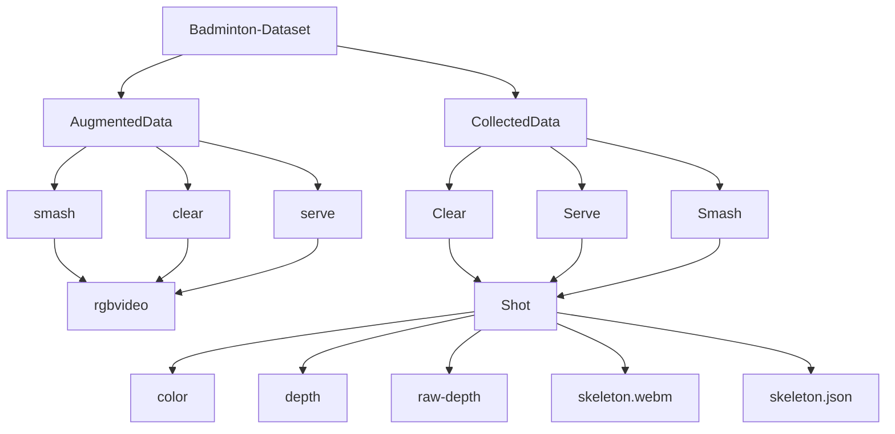

# Badminton-Dataset
Badminton Dataset recorded using Kinectron software with Kinect for Windows we have used multiple feeds (frames) at the same time. We have used ‘Color’, ‘Depth’, ‘Raw Depth’, and ‘Skeleton (Tracked Bodies)’. All these files are in webm format, Skeleton also provides JSON files for 24 points located on the body. Dimensions of images are Color: 1920 x 1080 and Depth: 512 x 424.
```
CollectedData has 328 videos per class {Clear, Serve, Smash}
AugmentedData has 5516 videos in total
 * clear-> 1712 videos
 * serve->1861 videos
 * smash->2111 videos
```

## Repository Structure

